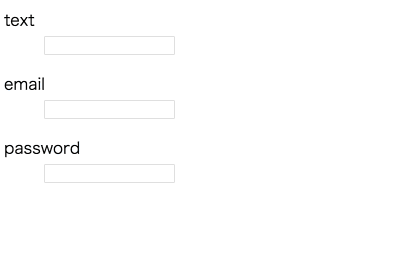

## vuejsのフォームを自動生成するプラグイン

### 作成中

- [ ] インスタンス毎の名前空間に格納
- [x] submitの表示
- [x] formの値を受け渡すインターフェース
- [ ] input[type="check"]
- [ ] input[type="radio"]
- [ ] select
- [ ] textarea

### 使い方

```js
const defaultForm = new VueForm();
Vue.use(defaultForm);
```

```html
<vue-form></vue-form>
```



### カスタムして使う
```js
const customForm = new VueForm({
  name: 'your-custom-name',
  items: [
    {
      type: 'text',
      name: 'custom',
      dirty: true,
      errorMessage: '不正規な値です',
      minLength: 3,
      maxLength: 5,
      required: true,
    },
  ],
});
Vue.use(customForm);
```

```html
<your-custom-name></your-custom-name>
```


